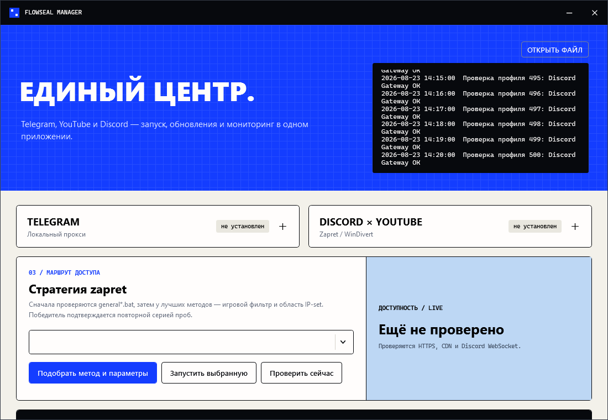

# Flowseal Manager

Нативное Windows-приложение для управления официальными [Flowseal/tg-ws-proxy](https://github.com/Flowseal/tg-ws-proxy) и [Flowseal/zapret-discord-youtube](https://github.com/Flowseal/zapret-discord-youtube). Менеджер сам устанавливает компоненты, проверяет новые GitHub Releases, запускает их вместе с Windows и выбирает рабочую стратегию zapret.

Проект не является официальным приложением Flowseal. Бинарники upstream не вшиты в менеджер и скачиваются только из официальных релизов.



## Главное

Flowseal Manager объединяет Telegram-прокси и Zapret в одном окне и одной иконке трея. Приложение само устанавливает официальные компоненты, убирает конфликтующие экземпляры, перебирает стратегии и параметры, следит за доступностью YouTube и Discord и позволяет безопасно управлять пользовательскими списками и `hosts`.

## Что реализовано

- единое русскоязычное Windows-приложение для Telegram, YouTube и Discord с общей иконкой в системном трее;
- установка TG WS Proxy и zapret из официальных GitHub Releases с поддержкой Windows x64 и ARM64;
- автоматическая проверка обновлений компонентов при запуске и сохранение работоспособной установленной версии при недоступности GitHub;
- автоматическое обновление самого Flowseal Manager из этого GitHub-репозитория с проверкой SHA-256 и возвратом предыдущей сборки при неудачном запуске;
- скрытый запуск TG WS Proxy и `winws.exe` без отдельных консольных окон и дополнительных значков управления;
- ручной запуск любой официальной стратегии `general*.bat` и автоматический подбор наиболее доступного варианта;
- проверка лучших стратегий с перебором режимов игрового фильтра и области IP-set;
- настройка игрового фильтра для TCP и UDP, выбор области IP-set и официальных `.bin`-подмен;
- редактор собственных доменов, IP/CIDR и исключений с проверкой введённых значений;
- сохранение пользовательских списков и параметров при обновлении zapret;
- управление официальным `.service/hosts` Zapret: проверка, установка, обновление, удаление и резервные копии;
- проверка доступности YouTube, медиасерверов Google, Discord API, CDN и WebSocket Gateway;
- фоновый мониторинг соединения и автоматическая смена стратегии после устойчивого ухудшения доступности;
- управление запуском компонентов вместе с Windows;
- обнаружение конфликтующих служб и посторонних экземпляров обхода с очисткой после подтверждения пользователя;
- журнал работы и диагностики внутри приложения;
- проверка целостности загружаемых файлов и безопасная распаковка обновлений.

## Быстрый запуск

Требования для сборки: Windows 10/11 и .NET SDK 8. Готовая self-contained сборка не требует установленного .NET.

```powershell
cd flowseal-manager
.\scripts\build.ps1
.\dist\win-x64\FlowsealManager.exe
```

Для Windows on ARM:

```powershell
.\scripts\build.ps1 -RuntimeIdentifier win-arm64
```

При запуске Windows покажет UAC: права администратора нужны WinDivert. При первом старте приложение скачает последние версии компонентов. TG WS Proxy работает скрыто под управлением общей иконки менеджера. Затем нажмите «Подобрать метод и параметры» для zapret.

Если zapret или другие обходы запускались до установки менеджера, нажмите «Удалить старые службы». Приложение покажет найденные имена служб и посторонние процессы `winws.exe`, запросит подтверждение, остановит оставшиеся `winws.exe` и удалит только известные службы. После очистки заново запустите автоматический поиск стратегии.

Если в трее уже появилось несколько значков TG WS Proxy, нажмите у него «Запустить»: менеджер завершит старые/дублирующиеся экземпляры и оставит один актуальный. Собственный `Run`-автозапуск TG WS Proxy удаляется, чтобы при следующем входе в Windows не возникали дубли; дальше Telegram-прокси запускается общей задачей менеджера.

Текущая локальная сборка не подписана коммерческим code-signing сертификатом, поэтому SmartScreen может показать предупреждение «Неизвестный издатель». Исходный код открыт; SHA-256 готового файла приведён в отчёте сборки. Для публичного распространения рекомендуется подписать EXE своим сертификатом.

## Версии и автообновление

У проекта два независимых номера:

- **версия релиза** — `vX.Y.Z`, видна на GitHub и используется для поиска обновлений;
- **версия сборки** — `A.B.C.D`, видна в приложении и нужна для диагностики конкретного бинарного файла.

Оба номера задаются только в `Directory.Build.props`. Изменять их в интерфейсе, README или сценариях сборки отдельно не требуется.

Каждый новый стабильный GitHub Release должен содержать четыре файла:

- `FlowsealManager-win-x64.zip`;
- `FlowsealManager-win-arm64.zip`;
- `update-manifest.json`;
- `SHA256SUMS.txt`.

Flowseal Manager проверяет `releases/latest`, выбирает пакет под архитектуру Windows, сверяет размер и SHA-256 из манифеста, распаковывает его в отдельный временный каталог и только затем перезапускается. Перед заменой создаётся резервная копия текущих файлов. Если новая версия не подтвердит успешный запуск, обновлятор автоматически восстановит предыдущую сборку. Настройки, скачанные компоненты Flowseal, пользовательские списки и системный `hosts` находятся вне каталога приложения и не заменяются.

Первый переход с `v1.0.0` на версию с новым обновлятором выполняется вручную. Начиная с `v1.1.0`, следующие стабильные релизы могут устанавливаться автоматически.

## Выпуск новой версии

1. Измените `ReleaseVersion` и `BuildVersion` в `Directory.Build.props`.
2. Подготовьте русское описание `RELEASE-X.Y.Z.md`.
3. Соберите локальный пакет командой `./scripts/package-release.ps1`.
4. Проверьте содержимое каталога `release` и поставьте тег, совпадающий с `ReleaseVersion`, например `v1.1.0`.
5. Отправьте тег на GitHub. Workflow проверит тесты и номер тега, соберёт x64/ARM64, сформирует манифест и опубликует GitHub Release с подготовленным описанием.

Опубликованный тег и бинарные файлы не заменяются задним числом. Любое изменение приложения получает новый номер релиза.

Компоненты хранятся в `%ProgramData%\FlowsealManager`. Этот путь не зависит от кириллицы в имени пользователя, что важно для штатных batch-файлов zapret. Пользовательские настройки и журнал находятся в `%LocalAppData%\FlowsealManager`. При первом запуске автоматически создаётся задача Windows `FlowsealManager`; отключение флажка удаляет её.

Параметры метода сохраняются в совместимые с upstream файлы `list-general-user.txt`, `list-exclude-user.txt`, `ipset-general-user.txt`, `ipset-exclude-user.txt`, `game_filter.enabled` и активные UDP `.bin`. Они переносятся в новую версию zapret при обновлении. Кнопка «Сохранить и применить» перезапускает текущую стратегию, если она уже работала.

Кнопка «Hosts Zapret» в окне параметров управляет официальным `.service/hosts` Flowseal для GitHub, Telegram и Discord. Менеджер записывает его в системный `hosts` отдельным помеченным блоком, перед каждой записью создаёт резервную копию в `%LocalAppData%\FlowsealManager\backups\hosts` и при удалении не затрагивает остальные пользовательские строки.

## Как выбирается стратегия

Менеджер сначала запускает последнюю успешную стратегию, затем перебирает остальные `general*.bat` в естественном порядке. После первого прохода у трёх сильнейших методов проверяется матрица из четырёх режимов игрового фильтра и трёх областей IP-set. Пользовательские домены, IP, исключения и выбранные UDP `.bin` при этом не стираются. Для каждой комбинации одновременно проверяются:

- `www.youtube.com/generate_204`;
- статическое изображение с `i.ytimg.com`;
- соединение с `redirector.googlevideo.com`;
- `discord.com/api/v10/gateway` с проверкой ответа;
- изображение с `cdn.discordapp.com`;
- настоящий WebSocket Hello от `gateway.discord.gg`.

Идеальный кандидат принимается только после второй полностью успешной серии. Если результата 6/6 нет, три лучших варианта проверяются повторно и выбирается устойчивый максимум по взвешенному покрытию: API и Gateway важнее миниатюр. Фоновый мониторинг сравнивает сеть с сохранённым уровнем победителя, поэтому частичный максимум не вызывает бесконечный перебор; повторный поиск начинается только после трёх реальных ухудшений. Файлы `general*.bat` не исполняются: менеджер безопасно извлекает из них аргументы текущего официального профиля и запускает `winws.exe` напрямую со скрытым окном.

Ни одна внешняя проверка не может математически гарантировать работу всех сценариев. В частности, Discord Voice использует авторизованную сессию и UDP, а YouTube выдаёт динамические медиасерверы. Поэтому `.bin`-подмены сохраняются в найденном профиле, но не ранжируются по ложному HTTP-сигналу: окончательная проверка голосового UDP выполняется фактическим звонком, а игрового UDP — соответствующей игрой. Для YouTube окончательная проверка воспроизведения также остаётся за пользователем.

## Важные замечания

- Включите Secure DNS по инструкции upstream. DNS-блокировка не исправляется выбором параметров `winws`.
- WinDivert может определяться антивирусом как `RiskTool`/PUA. Сверяйтесь с документацией Flowseal и не отключайте защиту целиком.
- Если уже установлена служба `zapret` через `service.bat`, используйте кнопку очистки в менеджере: одновременно запускать старую службу и менеджер нельзя.
- Менеджер изменяет системный `hosts` только по явному нажатию в разделе «Hosts Zapret» и управляет исключительно собственным помеченным блоком; сторонние строки не удаляются.
- Закрытие окна крестиком сворачивает Flowseal Manager в системный трей и при первом закрытии показывает подсказку. Окно открывается двойным щелчком по значку или повторным запуском `FlowsealManager.exe`; новый экземпляр не создаётся. Кнопка «Выход» полностью завершает менеджер.
- Менеджер запускает TG WS Proxy в headless-режиме и остаётся единственным значком управления в трее.
- Автоматический перебор временно перезапускает `winws.exe`, поэтому текущие соединения могут кратко прерываться.

## Разработка и проверка

```powershell
dotnet restore FlowsealManager.sln
dotnet build FlowsealManager.sln -c Release --no-restore
dotnet run --project tests\FlowsealManager.Core.Tests\FlowsealManager.Core.Tests.csproj -c Release --no-build
```

Тестовый проект не использует внешние test-framework пакеты: это позволяет собирать приложение даже в изолированной среде. Он проверяет защиту ZIP от path traversal, атомарные настройки, выбор релизного артефакта, логику health report и команду автозапуска.

## Лицензии

Исходный код менеджера — MIT, см. [LICENSE](LICENSE). Уведомления о Flowseal, zapret и WinDivert находятся в [THIRD-PARTY-NOTICES.md](THIRD-PARTY-NOTICES.md); официальный `LICENSE.txt` сохраняется внутри скачанного архива zapret.
